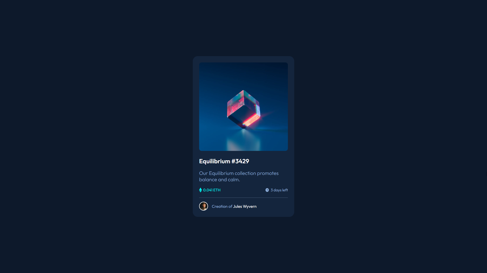
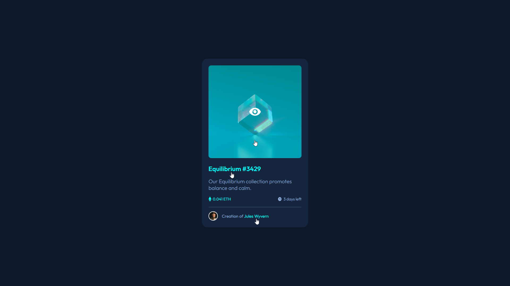
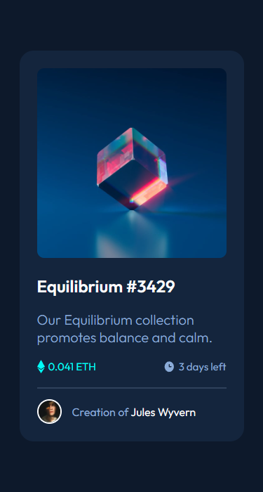

# Frontend Mentor - NFT preview card component solution

This is a solution to the [NFT preview card component challenge on Frontend Mentor](https://www.frontendmentor.io/challenges/nft-preview-card-component-SbdUL_w0U). Frontend Mentor challenges help you improve your coding skills by building realistic projects. 

## Overview

### The challenge

Users should be able to:

- View the optimal layout depending on their device's screen size
- See hover states for interactive elements

### Screenshot 📷
#### Desktop Screenshot 🖥️

#### With Hover

#### Mobile Screenshot 📱

### link 🔗
- Live Site URL: https://lkiryu.github.io/nft-preview-card/

### Built with 🛠️
- HTML5
- CSS
---
### Author 👨‍💻
 Made by Matheus Antonio
